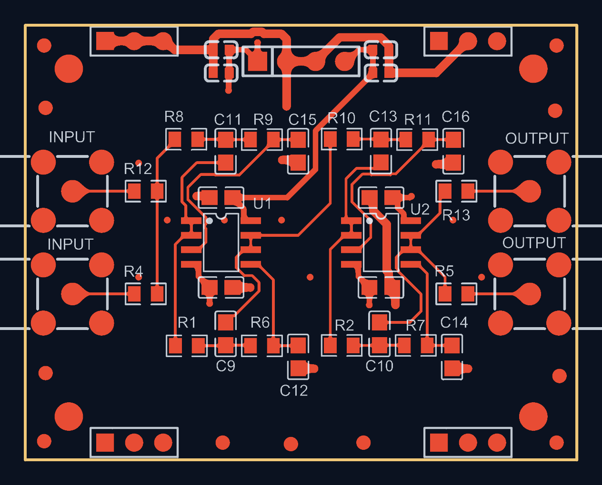
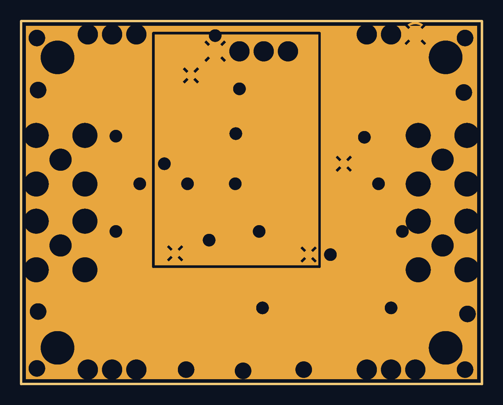
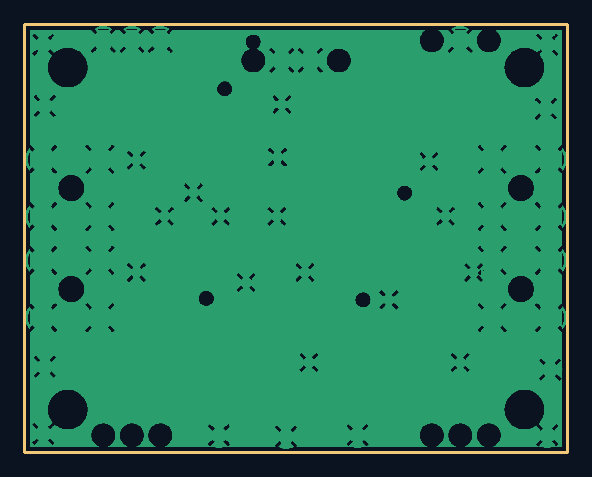
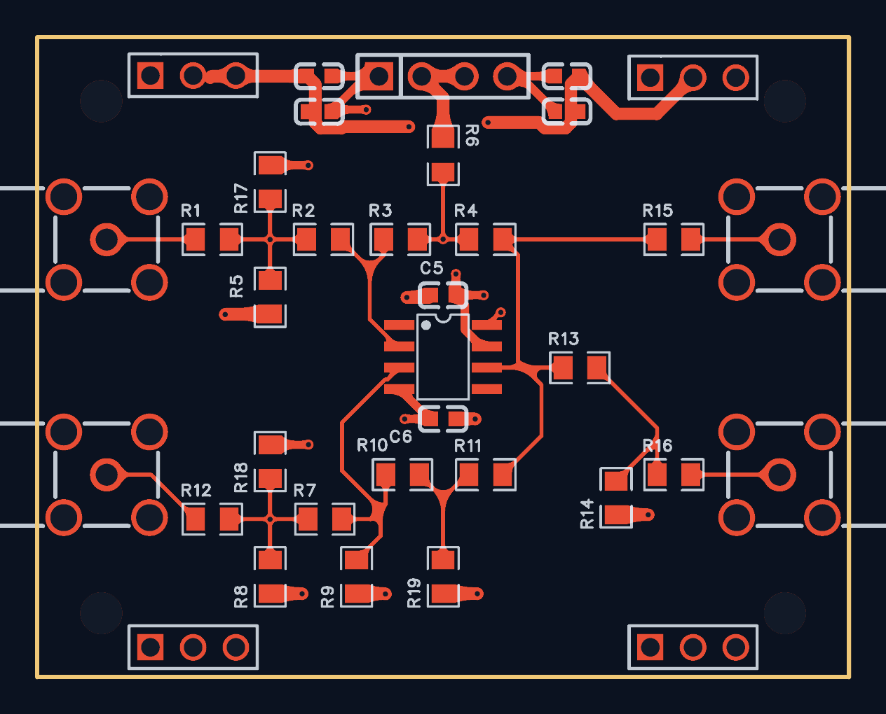
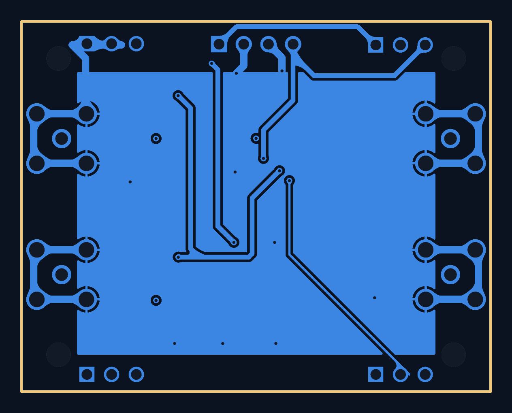

# PCB 设计作品集

> 通信工程专业大三学生，从零自学硬件 PCB 设计。两块自己画的板子（原理图 → 布局布线 → 叠层/平面 → DRC → Gerber → 嘉立创打样），附可送厂的制造文件。
>
> 工具链：**Altium Designer 25**（原理图 / 布局 / 布线 / 叠层 / 内电层 / DRC / Gerber）· **嘉立创EDA 专业版** · 嘉立创打样

---

## 作品集

### ★ 项目一：Butterworth 低通滤波器（**双层版 + 四层版**）

同一块板画两遍：先做双层，再改成**四层**（`SIG / GND / PWR / SIG`），吃透"参考平面"这件事。

- **±5 V 双通道 Sallen-Key 低通**，OPA2140 精密双运放 ×2，SMA 输入输出 ×4，48.260 × 38.100 mm
- 四层板：**L2 整片地平面** + **L3 电源平面（+5 V 上分割出 −5 V 孤岛）** + **19 个 GND 缝合孔**
- 两个版本都做到 **DRC 0 违规**；四层版 Gerber **10 个文件**（含 `GP1`/`GP2` 负片内电层），已逐项核验
- 全部配图**由 Gerber 数据渲染**（脚本见 [工具/gerber2png](作品集/工具/gerber2png/README.md)），图上即板厂拿到的图形

| 内电层分割（−5 V 孤岛） | 完整地平面（L2） |
|---|---|
|  |  |

📂 **[项目详解 →](作品集/Butterworth低通滤波器/README.md)** ｜ 源文件 → [双层版](作品集/Butterworth低通滤波器/双层版) · [四层版](作品集/Butterworth低通滤波器/四层版)
｜ 制造文件 → [双层 Gerber](作品集/Butterworth低通滤波器/双层版/Gerber) · [四层 Gerber](作品集/Butterworth低通滤波器/四层版/Gerber)

### 项目二：OPA_U 运放模块（双层 · **嘉立创EDA 绘制**）

| 顶层 | 底层（大面积 GND 铺铜） |
|---|---|
|  |  |

**TI OPA690 高速运放**反相放大模块（50 Ω 入/出、G ≈ −2），照实物抄板：4 个 SMA 贴边、
19 个电阻（含 0 Ω 配置跳线的"万能板"思路）、四角 M2.5 安装孔、底层大面积 GND 铺铜，48.26 × 38.10 mm。
**用嘉立创EDA专业版从原理图画到出 Gerber**，与滤波器板（AD）形成工具对照。
📂 **[项目详解 →](作品集/OPA运放板/README.md)**

---

## 会做什么

| 环节 | 技能 |
|---|---|
| 元件库 | 手画原理图符号与 PCB 封装（无 IPC 向导环境下）；从立创商城导入元件并沉淀**通用库** |
| 原理图 | 网络标签 / 电源端口 / 总线、编译查错、`No ERC` 豁免、封装管理器批量绑定 |
| 布局布线 | 接口靠边·信号流向·**差分对严格对称**·按模块分区；45° 走线、推挤、电源加粗、**原点法做对称** |
| 平面 | **四层叠层设计**、**内电层负片**、**平面分割（Split Plane）**、**缝合孔（Via Stitching）**、参考平面与跨分割 |
| 规则检查 | 间距 / 线宽 / 过孔 / 平面间隙规则配置，DRC 归零，`Shift+S` 单层目视核对 |
| 制造 | Gerber 层选择、NC Drill 单位格式一致、`.GM` 扩展名坑、下单参数核对、**Gerber 逐文件内容核验**（板框尺寸 / 单位格式 / 闪光数=孔数 / 与上一版逐孔对比） |

---

*更新于 2026-09-26*
