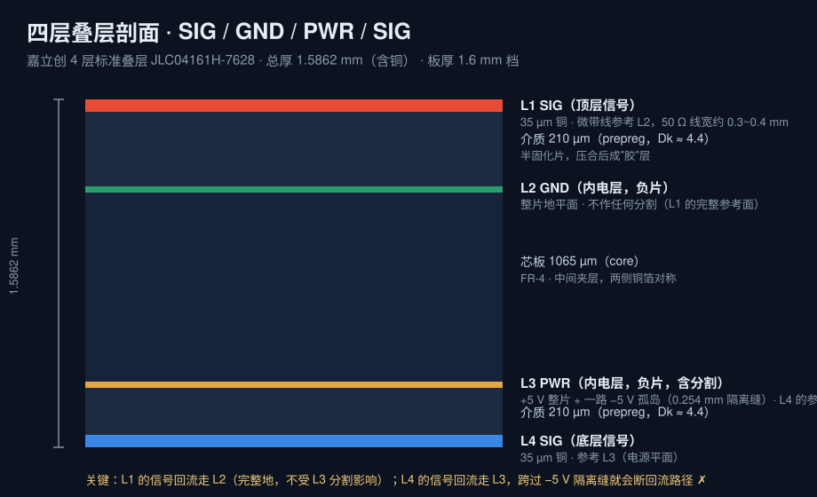

# Butterworth 低通滤波器 · 双层版 / 四层版


> 一句话：一块 **±5 V 供电的双通道 Sallen-Key 低通滤波器**，先按双层板走完整流程，再改成四层板（SIG / GND / PWR / SIG）对比教学，两个版本都出了可送厂的 Gerber 并逐项核验过。
>
> 工具：**Altium Designer 25.7.1** ｜ 板厂：嘉立创 4 层标准叠层 `JLC04161H-7628` ｜ 板框 **48.260 × 38.100 mm**

---

## 一、两个版本对比

| 项目 | 双层版 | 四层版 |
|---|---|---|
| 叠层 | Top / 介质 / Bottom | **L1 SIG · L2 GND · L3 PWR · L4 SIG** |
| 参考平面 | 无（回流靠走线） | L1 参考 **L2 完整地**；L4 参考 **L3 电源** |
| 内电层 | — | L2 = GND 整片；L3 = +5 V 整片 + **−5 V 孤岛（分割）** |
| 板厚 | 1.6 mm（下单参数） | 1.5862 mm → 1.6 mm 档 |
| 尺寸 | 48.260 × 38.100 mm | 48.260 × 38.100 mm（同一版图改叠层） |
| 过孔总数 | 53 | **72**（新增 19 个 GND 缝合孔） |
| Gerber 文件 | 8 个 | **10 个**（多 `GP1`/`GP2` 两个内电层） |
| DRC | 0 违规 | 0 违规 |
| 制造文件 | [`双层版/Gerber/`](双层版/Gerber) | [`四层版/Gerber/`](四层版/Gerber) |
| 源文件 | [`双层版/`](双层版) | [`四层版/`](四层版) |

AD 里的布线规则（两个版本一致，实测自 `PcbDoc`）：

| 规则 | 值 |
|---|---|
| 安全间距 `Clearance` | 10 mil (0.254 mm) |
| 线宽 `Width` | 默认 10 mil ／ 电源网络类 20 mil ／ GND 30 mil |
| 过孔 `RoutingVias` | 盘 24 mil / 孔 12 mil（0.6096 / 0.3048 mm） |
| 内电层间隙 `PlaneClearance` | 20 mil (0.508 mm) |
| 平面分割缝宽 | 0.254 mm（实测 Gerber 分割线光圈 `C,0.2540`） |

---

## 二、电路说明

| 项 | 内容 |
|---|---|
| 拓扑 | 每通道 **两级 Sallen-Key 级联**（单位增益 VCVS，运放 IN− 与 OUT 短接），通道 A / B 镜像对称 |
| 运放 | **OPA2140AID**（TI 精密双运放，11 MHz，SOIC-8）×2 —— 4 个运放单元全部用上 |
| 通道数 | 2（INPUT ×2 → OUTPUT ×2） |
| 接口 | **SMA**（BWSMA-KWE-Z001，板边贴片）×4 |
| 电源 | ±5 V + GND，排针输入；10 µF + 0.1 µF ×3 + 4 × 100 nF 去耦 |
| 配置跳线 | **0 Ω 电阻 R4 / R5 / R12 / R13** 选通道与直通；H2~H5 为 3 选 1 跳线排针 |
| 元件来源 | 全部按**立创商城**料号选型（C 编号见 [BOM-元件清单.csv](BOM-元件清单.csv)） |

> 说明：原理图按参考设计 *Butterworth_5or8th_V2_1_0*（5 阶 / 8 阶可选、NC 位决定阶数的"万能板"思路）在 AD 里重绘，
> **PCB 布局、四层叠层改造、内电层分割、缝合孔、Gerber 交付全部是本项目自己完成的**。

---

## 三、四层版重点做了什么

### 1. 叠层（要控阻抗的信号层必须紧贴完整平面）



```
L1  SIG   35 µm 铜      ← 微带线参考 L2，50 Ω 线宽约 0.3~0.4 mm
    介质 210 µm（prepreg，Dk≈4.4）
L2  GND   15 µm 铜      ← 整片地，不作任何分割（L1 的完整参考面）
    芯板 1065 µm（core）
L3  PWR   15 µm 铜      ← +5 V 整片 + −5 V 孤岛
    介质 210 µm（prepreg，Dk≈4.4）
L4  SIG   35 µm 铜      ← 参考 L3
```

反面教材 `SIG / SIG / GND / PWR` ✗ —— 顶层信号下面贴着的是另一个信号层，参考不到地。

### 2. 内电层是"负片"，文件里画的是**挖空**


L2 地平面：整片铜，中间那些圆点是**反焊盘**（过孔/焊盘不接 GND 时预留的隔离），
右下角的 ✕ 形是**热焊盘**（该点接 GND，用 4 条连接筋与平面相连，方便焊接散热）。

### 3. 平面分割：−5 V 孤岛


L3 主体是 **+5 V**，中间用一圈闭合矩形圈出的区域分配为 **−5 V**，中间那条缝就是**隔离带**（0.254 mm）。
两个关键约束（都踩过）：

- **−5 V 的过孔必须打在孤岛内部** ✗ 打在缝上或打在 +5 V 区里，孤岛就白做了；
- **L4（底层）的信号线不能跨过这条缝** ✗ 跨过去回流路径就断了 —— L1 的信号不受影响（它回流走 L2 完整地）。

### 4. 缝合孔：把表层地铜"缝"到地平面上

沿板边一圈加了 **19 个 GND 过孔**，把 L1/L4 的地铺铜与 L2 地平面连成一体（降地阻抗、抑制地噪声）。

### 5. 交付前逐项核验（这步才是"能送厂"的分水岭）

| 核验项 | 结果 |
|---|---|
| Gerber 文件数与命名 | 10 个文件，内电层 `GP1`(L2) / `GP2`(L3) |
| 格式与单位是否统一 | 全部 `%FSLAX44Y44*%` + `%MOMM*%`，全 ASCII |
| 板框尺寸 | GKO 实测 **48.260 × 38.100 mm**，与双层版完全一致 |
| 内电层极性 | `TF.FilePolarity,Negative`（负片），负片**必须**交 Gerber 不能交源文件 |
| 闪光数 vs 钻孔数 | 内电层闪光 **72** = 钻孔 **72**（没有孤立/多余焊盘） |
| 钻孔文件 | `M48` + `METRIC` + `TZ` + 4:4 + `PLATED`，7 把刀 |
| 与双层版逐孔对比 | 原 53 孔**字节级一致**，新增 19 孔（Ø0.3 mm ×8、Ø0.7112 mm ×11） |
| DRC | 0 违规（走线 / 间距 / 丝印 / 未布线 全通过）|
| 目视 | 单层看图（`Shift+S`）核对 L2 无断开、L3 分割缝两侧无压线 |

---

## 四、图片（全部由 **Gerber 数据**渲染，不是软件截图）

| 图 | 看什么 |
|---|---|
| [顶层装配视图](图片/四层-顶层装配视图.png) | 顶层铜 + 丝印 + 板框 + 钻孔，双通道对称布局 |
| [L2 GND 内电层](图片/四层-02-内电层L2-GND.png) | 完整地平面、反焊盘、热焊盘 |
| [L3 PWR 内电层](图片/四层-03-内电层L3-PWR含-5V分割.png) | +5 V 平面与 −5 V 孤岛分割 |
| [底层装配视图](图片/四层-底层装配视图.png) | 底层铜 + 底层丝印 |
| [叠层剖面](图片/四层-叠层剖面.svg) | 层序与厚度 |
| [双层版顶层](图片/双层-顶层装配视图.png) | 双层版的同一版图 |

> 渲染方法：配图由 [`作品集/工具/gerber2png/`](../工具/gerber2png/README.md) 脚本从 Gerber 明文数据直接渲染
> （支持 `G36/G37` 区域填充、光圈宏/热焊盘、`LPD/LPC` 极性、负片反相）—— 图上看到的就是**板厂拿到的图形**，
> 脚本能逐字节复现本目录的图。

---

## 五、从这块板学到/踩到的坑（挑三条最有价值的）

1. **"DRC 0 违规"≠ 板子没问题**。同一块板导进嘉立创EDA专业版会报 200+ 条错（Board Outline↔Track 间距 0.076 mm 之类），
   实测是**格式转换引入的虚拟板框**造成的 —— 同一处 Gerber 里量出来是 1.5 mm。**几何数据打架时，信 Gerber**（板厂只认 Gerber）。
2. **靠放宽规则把报错消到 0 是打地鼠**：182 平面↔平面 → 181 板框↔走线 → 178 平面↔过孔，
   而"平面↔过孔距离 0"恰恰是热焊盘连接**正常**的样子 —— 规则一旦放到"平面可以和任何东西叠在一起"，DRC 就失去意义了。
3. **隔离缝宽度 = 你画的那条线的线宽**（不是规则里的值）。这次是 0.254 mm，画完必须单层量一遍。

---

## 六、待完善（诚实清单）

- [ ] **滤波电阻值未定**：R1 / R2 / R6–R11 在原理图里还是占位 `XX`，需按参考设计定值后再打样（其余料已齐）
- [ ] 上电实测：幅频特性（网络分析仪 / 扫频）与理论曲线的对比
- [ ] 未做拼板与工艺边（单片 48.26 × 38.10 mm，未到嘉立创拼板免加钱的尺寸档）
- [ ] **尚未打样**：两个版本都已出图并核验（送厂直接用 `Gerber/` 目录里的压缩包），实物测试数据待补

---

## 七、文件说明

```
Butterworth低通滤波器/
├── README.md                 ← 本文件
├── BOM-元件清单.csv           ← 元件清单（型号 / 封装 / 立创编号 / 位号）
├── 图片/                      ← Gerber 渲染图 + 叠层剖面
├── 双层版/
│   ├── butterworth5-8th.SchDoc    ← AD 原理图
│   ├── butterworth5-8th.PcbDoc    ← AD PCB（双层）
│   └── Gerber/                    ← 8 个 Gerber + 钻孔 + 提交用的 zip
└── 四层版/
    ├── butterworth5-8th.SchDoc    ← 同一张原理图
    ├── butterworth_4layer.PcbDoc  ← AD PCB（四层，含内电层分割）
    ├── butterworth_4layer.PrjPcb  ← AD 工程文件
    └── Gerber/                    ← 10 个 Gerber + 钻孔 + 提交用的 zip
```

**怎么看**：没有 AD 也能看 —— 直接打开 `图片/` 里的图，或看 `Gerber/` 里的文本（Gerber 是明文，能直接读）；
想复现就在 AD 25 里新建工程，把 `.SchDoc` + `.PcbDoc` 加进去即可。

---

## English Abstract

A dual-channel **Sallen-Key low-pass filter** board (±5 V rails, SMA in/out, OPA2140 precision op-amps, 48.26 × 38.10 mm),
designed twice: first as a **2-layer** board, then re-engineered as a **4-layer** board
(SIG / GND / PWR / SIG on JLCPCB's `JLC04161H-7628` stack) with a solid ground plane,
a split power plane carrying a **−5 V island**, and GND **via stitching**.
Both versions reached **zero DRC violations** and ship with a fully verified Gerber package
(10 files, uniform `%FSLAX44Y44*%`/`%MOMM*%`, 72 drill hits matching the plane flashes).
All images are rendered directly from the Gerber data.
Tooling: Altium Designer 25.7.1 (schematics, layout, routing, plane splitting, DRC, Gerber out).
